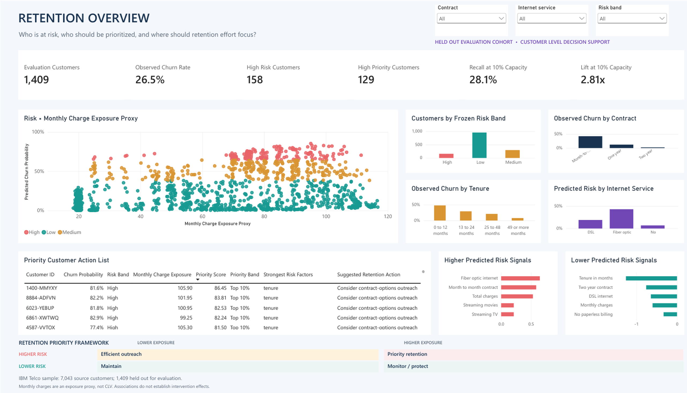
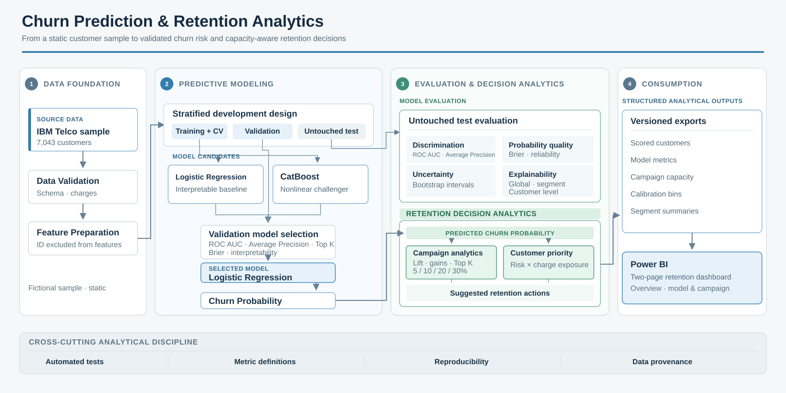
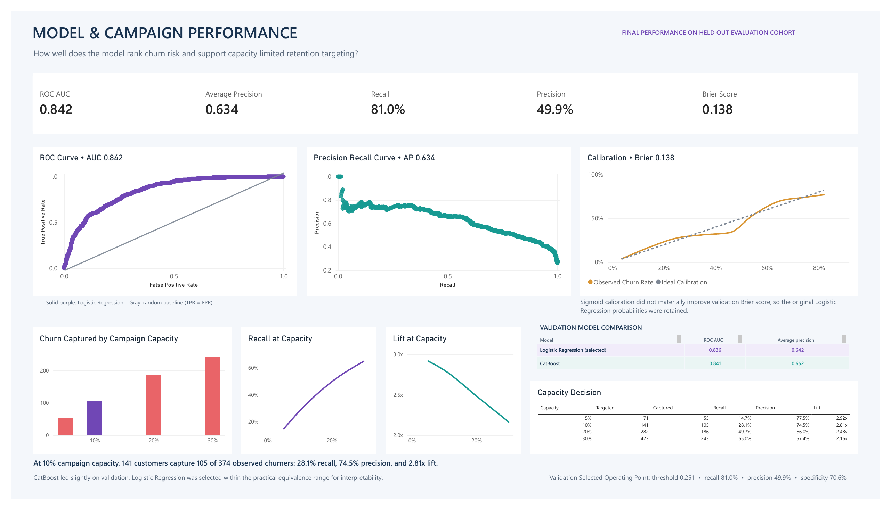

# Churn Prediction & Retention Analytics

Predictive modeling and retention analytics system that identifies customers at churn risk, explains key signals, and converts model outputs into prioritized retention decisions.



*Retention Overview connects predicted risk, customer segments, charge exposure, and outreach priorities.*

## Business Problem

Which customers are most likely to churn, why are they at risk, and who should be prioritized when retention capacity is limited?

A churn probability alone is not enough. The workflow identifies high risk customers, examines signals associated with their scores, ranks customers by risk and charge exposure, and shows how campaign capacity changes the target group.

## Key Results

Final performance is measured on an untouched test cohort.

| Measure | Result |
| --- | ---: |
| Evaluation customers | 1,409 |
| Observed churners | 374 |
| ROC AUC | 0.842 |
| Average Precision | 0.634 |
| Recall | 81.0% |
| Precision | 49.9% |
| Brier Score | 0.138 |
| Customers targeted at 10% capacity | 141 |
| Observed churners captured | 105 |
| Recall at 10% capacity | 28.1% |
| Precision at 10% capacity | 74.5% |
| Lift at 10% capacity | 2.81x |
| High Risk customers | 158 |
| Top 10% Priority Band customers | 129 |

High Risk is a predicted risk category. Priority Band combines predicted risk with monthly charge exposure. Campaign Capacity selects the highest ranked customers for a fixed outreach limit. The three counts are intentionally different.

## Why This Matters Across Industries

| Sector | Comparable retention problem |
| --- | --- |
| Telecom | Subscriber cancellation |
| Banking | Account attrition or declining engagement |
| Insurance | Policy lapse or nonrenewal |
| Energy and utilities | Contract switching or cancellation |
| Automotive | Lease, subscription, connected service, or aftersales attrition |
| SaaS and technology | Subscription cancellation or renewal risk |
| Retail and e-commerce | Repeat purchase decline or loyalty attrition |
| Healthcare | Patient or program disengagement |
| Industrial, chemicals, and B2B | Account attrition, renewal risk, or declining purchase activity |
| Logistics | Declining shipment activity or customer account attrition |

The Telco dataset is the demonstration domain. The trained model is not assumed to transfer directly across industries. What transfers is the analytical framework for risk estimation, prioritization, capacity aware targeting, explanation, and retention decision support.

## How It Works



The IBM Telco sample contains 7,043 customers, 21 source fields, and 1,869 churners. Eleven blank `TotalCharges` values occur at tenure zero and are converted to zero in memory using a documented validation rule. Customer ID remains an analytical key but is excluded from model features.

The data is split into 4,225 training, 1,409 validation, and 1,409 test customers with a fixed stratified seed. Training folds handle model tuning and learned preprocessing. Validation determines the model, calibration decision, threshold, and risk and priority cutoffs. The test cohort remains untouched until those decisions are frozen.

The workflow moves from validation and preprocessing through Logistic Regression and CatBoost candidates, validation based selection, untouched test evaluation, explainability, customer prioritization, structured exports, and Power BI.

## Model Performance & Decision Logic

| Candidate | Validation ROC AUC | Validation Average Precision |
| --- | ---: | ---: |
| Logistic Regression | 0.836 | 0.642 |
| CatBoost | 0.840 | 0.651 |

CatBoost performed slightly better on validation discrimination. The differences in Average Precision, Top 10% recall, and Brier Score remained within predefined practical equivalence ranges. Logistic Regression was retained for comparable predictive performance and simpler interpretation.

The final held out metrics are reported in Key Results. Recall and precision use the 0.251 threshold chosen on validation data for an 80% recall scenario. ROC AUC and Average Precision evaluate ranking across thresholds.

Probability quality was assessed with reliability bins and Brier Score. Sigmoid calibration did not materially improve validation Brier Score, so the original Logistic Regression probabilities were retained. At the highlighted 10% campaign capacity, the selected group contains 2.81 times the churn concentration expected from random targeting at the same capacity. Ten percent is a planning scenario, not a mathematically proven optimum.

Machine readable evidence is available in the [run manifest](reports/metrics/run_manifest.json), [candidate comparison](reports/metrics/validation_candidates.csv), and [campaign capacity table](powerbi/exports/campaign_capacity.csv).

## Key Insights & Retention Prioritization

- At 5% campaign capacity, 71 customers capture 55 observed churners with 77.5% precision and 2.92x lift.
- Month to month customers have 42.6% observed churn prevalence, compared with 2.7% for two year contracts.
- Customers in their first 12 months have 47.9% observed churn prevalence, compared with 10.0% among customers with 37 to 72 months of tenure.
- Fiber optic customers have 41.1% observed churn prevalence, while customers with no internet service have 8.0%.
- The two year contract subgroup has zero recall at the selected threshold. Its low prevalence and nine observed churners require careful interpretation.

Customer priority uses:

```text
Priority Score = Churn Probability × MonthlyCharges
```

`MonthlyCharges` is labeled **Monthly Charge Exposure Proxy**. It is not customer lifetime value, profit, or expected revenue saved.

Global coefficients, segment summaries, and customer level contrasts describe attributes associated with higher or lower predicted churn risk. Suggested retention actions are discussion prompts. They are not interventions with measured causal effects.

## Power BI Dashboard

### Retention Overview

The hero page shows risk bands, customer segments, priority customers, risk and charge exposure, model signals, and the retention priority framework. Slicers allow review by contract, internet service, and risk band.

### Model & Campaign Performance



The second page presents ROC AUC, Average Precision, calibration, campaign capacity, lift, the validation model comparison, and the selected operating point.

The public release includes both screenshots, the [dashboard contract](powerbi/README.md), aggregate exports, and the [metric dictionary](powerbi/metric_dictionary.csv). The PBIX is excluded because its embedded data model contains customer level records derived from the source data.

## Tech Stack

Python 3.12 · pandas · scikit-learn · CatBoost · matplotlib · pytest · Power BI

## Run Locally

Create a Python 3.12 environment and install dependencies:

```bash
python3.12 -m venv .venv
source .venv/bin/activate
python -m pip install -r requirements.txt
```

Obtain the IBM sample as described in [data/README.md](data/README.md) and place it at `data/raw/telco_customer_churn.csv`. The pipeline does not download data automatically.

```bash
python scripts/run_training.py
python scripts/build_powerbi_exports.py
python -m pytest -q
```

For a separate unlabeled customer file with the required schema:

```bash
python scripts/run_scoring.py INPUT.csv OUTPUT.csv
```

The current release passes all 21 automated tests.

## Notes & Limitations

- The fictional dataset is a static snapshot without a rigorous future prediction horizon.
- No treatment outcome data supports causal intervention or savings claims.
- Monthly charge exposure is a prioritization proxy, not customer lifetime value.
- The trained Telco model is not assumed to transfer directly across sectors.
- Campaign capacity scenarios do not include contact costs or treatment response.

The raw source dataset is not included because redistribution rights remain unclear. Repository code and documentation use the [MIT License](LICENSE); dataset rights remain separate.
